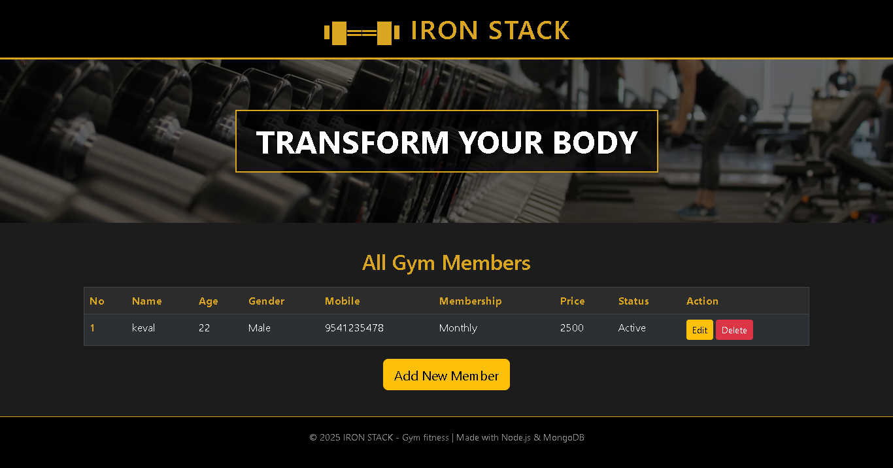
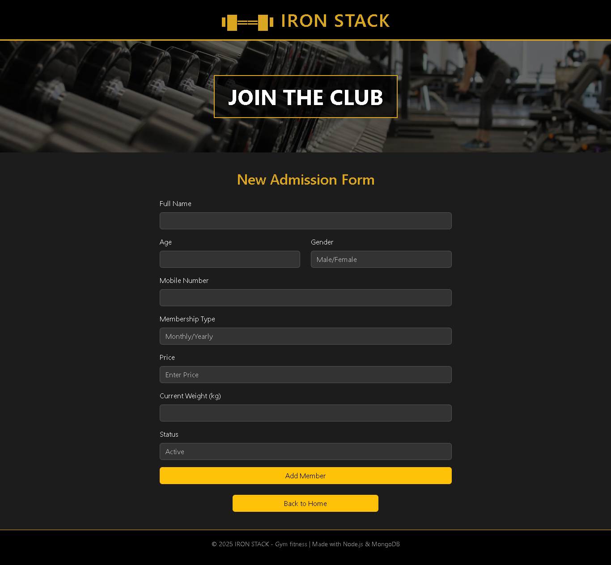

# ❚█══█❚ IRON STACK - Gym Management System


> A comprehensive **CRUD-based Fitness Tracker Application** designed to manage gym memberships efficiently. Built with the **MVC Architecture** using Node.js, Express, and MongoDB.

---

## 🌟 Features

* **Create:** Add new members with detailed validation (Age, Gender, Membership Type).
* **Read:** View all active gym members in a clean, responsive Dashboard Table.
* **Update:** Edit member details (Status, Weight, Membership plans) easily.
* **Delete:** Remove records of members who have left.
* **UI/UX:** Modern, Dark-Themed UI designed with Semantic HTML5 & CSS3.
* **Database:** Real-time data storage using MongoDB Atlas / Compass.

---

## 📸 Project Screenshots

Here is a glimpse of the application interface:

| **Dashboard (Home Page)** | **New Admission (Add Form)** |
|:---:|:---:|
|  |  |
| *List of all members with actions* | *Form with validation* |

---

## 🛠️ Tech Stack Used

* **Backend:** Node.js, Express.js
* **Frontend:** EJS (Templating Engine), HTML5, CSS3 (Custom Dark Theme)
* **Database:** MongoDB, Mongoose ODM
* **Architecture:** MVC (Model - View - Controller) pattern

---

## 📂 Project Structure

```text
Gym-Tracker-Project/
│
├── config/
│   └── db.config.js       # Database Connection Logic
│
├── models/
│   └── GymMember.js       # Mongoose Schema & Model
│
├── public/
│   └── css/
│       └── style.css      # Custom Styling (Dark/Gold Theme)
│
├── views/
│   ├── table.ejs          # Home Page (View Members)
│   ├── form.ejs           # Add Member Page
│   └── edit.ejs           # Update Member Page
│
├── screenshots/           # Images for README
│   ├── home.png
│   ├── form.png
│   └── edit.png
│
├── server.js              # Main Entry Point (Routes & Logic)
└── package.json           # Project Dependencies
```

---

## 🚀 How to Run Locally

Follow these steps to get the project up and running on your machine:

### 1. Clone the Repository (or Download)
Open your terminal in the project folder.

### 2. Install Dependencies
Install all the required NPM packages automatically.
```bash
npm install
```

### 🍃 3. Setup Database
Ensure **MongoDB** is running on your system (MongoDB Compass).
* Database Name: `Gym-Tracker`
* Collection Name: `GymMembers`
* *(Note: The application will create these automatically upon first insertion)*

### ⚡ 4. Start the Server
Run the application using Node.js.
```bash
node server.js
```

### 🌍 5. Access the App
Open your browser and navigate to:
```bash
http://localhost:3000
```

---

## 👨‍💻 Author

**Hardik**
* Student & Full Stack Developer
* [🌐 My GitHub Project](https://github.com/HardikSoni1994/Node.js/tree/master/Gym%20fitness%20Tracker)
* Created as a part of Backend Development Learning Module.